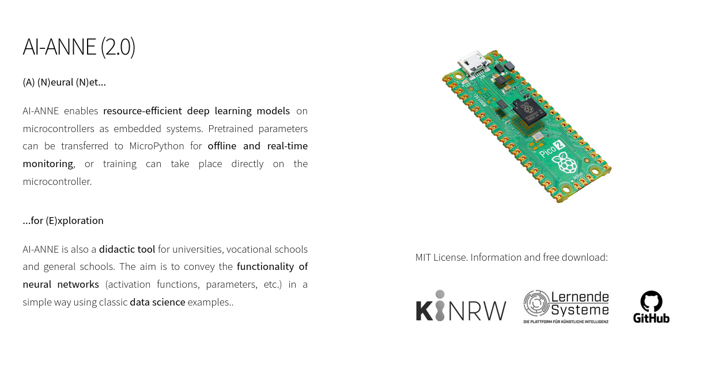
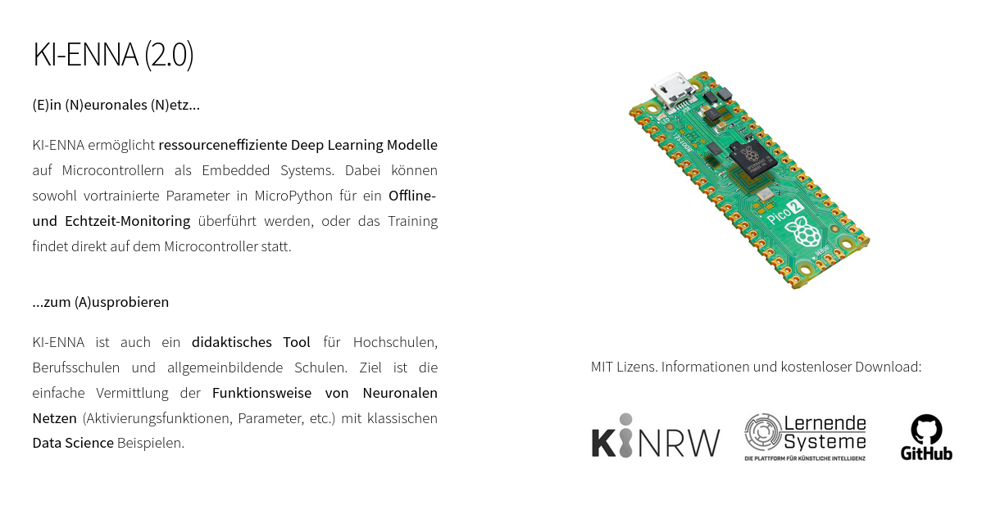

# AI-ANNE
(A) (N)eural (N)et for (E)xploration

# Author
Prof. Dr. habil. Dennis Klinkhammer

# Requirements
TensorFlow in Python (Anaconda Cloud); MicroPython (Thonny)

# Web-Demo (no Requirements)
Just follow the link: ]

# Selected Research Applications
AI-ANNE is currently being used in the field of computer vision as a supplement to electron microscopes for medical diagnostics.
An ongoing research project is testing the use of AI-ENNA to detect hazards in the rescue lane of emergency vehicles.

# Materials and Short Tutorial
The “python” folder contains a data set in CSV format as well as Jupyter notebooks for two neural networks for classification.
The data sets were each used as the basis for training the neural networks with TensorFlow in Python.
The parameters of the neural networks were then extracted as a TXT file.
The “micropython” folder contains the **code for initializing the microcontroller** (*main.py*).
This is **copied to the microcontroller** via Thonny and the microcontroller is then restarted.
The IRIS data set and the DIABETES data set are available as example data sets.
'ReLU', 'Leaky ReLU', 'Sigmoid', 'Softmax' and 'Tanh' are available as activation functions.
If required, other classification data can be used for training in Python.
For other data sets, the parameters of the neural networks must be adjusted accordingly.
AI-ANNE-B(asic) (*ai-anne-b.py*) works directly in Thonny and any Python environment, even without display, RGB matrix or dependencies and demonstrates pretrained neural networks as well as forward and backward propagation on a microcontroller.

# How to Use and Support AI-ANNE
AI-ANNE primarily **enables hardware-related programming with insights into the functioning of neural networks** for pupils and students.
For this purpose, the architecture of neural networks and underlying functions (matrix multiplication, etc.) including the transfer of weights and biases are provided in MicroPython.
Teachers can use the examples provided or develop their own examples and make them available here voluntarily.
This only requires a Jupyter notebook with the pre-trained neural network in Python and its counterpart in MicroPython.
Improvements to the AI-ANNE code are also very welcome. Just get in touch with me here on GitHub :-)

# Application Example
This is an example of how AI-ANNE can be used as an interactive learning tool in the classroom:

# License & Acknowledgment
The current version 2.0.1 of AI-ANNE is available under **MIT License**.
Version 1.0 from 2021 was available under the German Free Software License.
Special thanks **@tonygod2** from instructables.com for his tutorials on getting the display up and running.

------------------------------------------------------------------------------------------

# KI-ENNA
(E)in (N)euronales (N)etz zum (A)usprobieren

# Autoren
Prof. Dr. habil. Dennis Klinkhammer

# Voraussetzungen
TensorFlow in Python (Anaconda Cloud); MicroPython (Thonny)

# Ausgewählte Forschungsanwendungen
Aktuell kommt KI-ENNA im Bereich Computer Vision als Ergänzung von Elektronenmikoskopen für die medizinische Diagnostik zum Einsatz.
In einem laufenden Forschungsvorhaben wird der Einsatz von KI-ENNA zur Detektion von Gefahren auf der Rettungsgasse von Rettungsfahrzeugen erprobt. 

# Materialien und Kurzanleitung
Im Ordner "python" befindet sich jeweils ein Datensatz im CSV-Format sowie Jupyter Notebooks für zwei Neuronale Netze zur Klassifikation.
Die Datensätze wurden jeweils als Grundlage für das Training der Neuronalen Netze mit TensorFlow in Python verwendet.
Die Parameter der Neuronalen Netze wurden daraufhin als TXT-Datei extrahiert.
Im Ordner "micropython" befindet sich der **Code zur Initialisierung des Microcontrollers** (*main.py*).
Dieser wird via Thonny **auf den Microcontroller kopiert** und dieser anschließend neu gestartet.
Als Beispieldatensätze stehen der IRIS Datensatz und der DIABETES Datensatz zur Verfügung.
'ReLU', 'Leaky ReLU', 'Sigmoid', 'Softmax' und 'Tanh' stehen als Aktivierungsfunktionen zur Verfügung.
Bei Bedarf können andere Klassifikationsdaten für das Training in Python verwendet werden.
Bei anderen Datensätzen sind die Parameter der Neuronalen Netze entsprechend anzupassen.
KI-ENNA-B(asic) (*ki-enna-b.py*) funktioniert direkt in Thonny und jeder Python Umgebung, ganz ohne Display, RGB-Matrix oder Abhängigkeiten und demonstriert sowohl vortrainierte Neuronale Netze als auch Forward und Backward Propagation direkt auf dem Microcontroller.

# Wie Sie KI-ENNA nutzen und unterstützen können
KI-ENNA **ermöglicht vornehmlich das hardwarenahe Programmieren mit Einblicken in die Funktionsweise von Neuronalen Netzen** für Schülerinnen und Schüler sowie Studierende.
Hierfür wird die Architektur Neuronaler Netze sowie zugrundeliegende Funktionen (Matrixmultiplkation, etc.) einschließlich der Transfer von Weights und Biases in MicroPython vorgegeben.
Lehrerinnen und Lehrer können auf die vorgegebenen Beispiele zurückgreifen und eigene Beispiele entwickeln und freiwillig hier zur Verfügung stellen.
Dies erfordert lediglich ein Jupyter Notebook mit dem vortrainierten Neuronalen Netz in Python sowie dessen Abbild in MicroPython.
Auch Verbesserungen am Code von KI-ENNA sind herzlich willkommen. Melden Sie sich einfach hier auf GitHub bei mir :-)

# Anwendungsbeispiel
Dies ist ein Beispiel, wie KI-ENNA als interaktives Lerntool im Klassenraum verwendet werden kann:

# Lizenz & Danksagung
In der aktuellen Version 2.0.1 steht KI-ENNA unter der **MIT Lizens** zur Verfügung.
Version 1.0 von 2021 war noch unter der German Free Software License verfgügbar.
Besonderer Dank gilt **@tonygod2** von instructables.com für seine hilfreichen Display-Tutorials.

------------------------------------------------------------------------------------------
